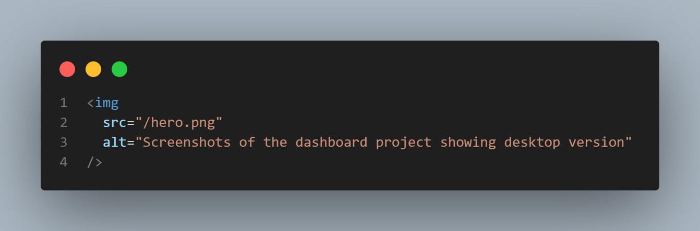
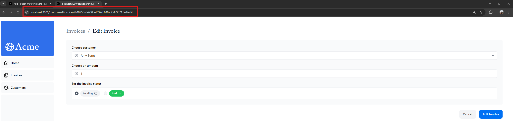

### 📌 CHAP 2 - Optimizing Fonts and Images

With regular HTML, add an image as follows:

However, this means have to manually ensure the image is responsive on different screen sizes.

➡️ Use `next/image` component to automatically optimize images.

👉 **The `<Image>` component**
The `<Image>` Component is an extension of the HTML `` tag, and comes with automatic image optimization, such as:
- Preventing layout shift automatically when images are loading.
- Resizing images to avoid shipping large images to devices with a smaller viewport.
- Lazy loading images by default (images load as they enter the viewport).

### 📌 CHAP 3 - Layout and Pages

### 📌 CHAP 4 - Navigating Between Pages
- Learn about how navigation works in `Next.js` vs `React.js`
- Use usePathname and clsx to show active link

### 📌 CHAP 9 - Streaming
- Dùng `Skeleton` và `Route group` để load từng component và hiện ui loading
- Dùng `Suspense` để bọc các component cần thời gian load 
- Nếu bọc folder trong cặp ngoặc `()` thì sẽ không ảnh hướng tới URL
ví dụ: `dashboard/(overview)/page.tsx` thì URL sẽ là `/dashboard`

### 📌 CHAP 11 - Adding Search and Pagination
- These are the Next.js client hooks that you'll use to implement the search functionality
- `useSearchParams`,
- `usePathname` cho phép đọc địa chỉ đường dẫn của URL hiện tại
- `useRouter` 

### 📌 CHAP 12 - Mutating Data
- Using Server Actions to mutate data.
- Using `bind` to encoded ensitive data. 
- Using a hidden input field in your form also works (e.g. `<input type="hidden" name="id" value={invoice.id} />`) but will appear as full text in the HTML source
- `revalidatePath` API to revalidate the Next.js cache and `redirect` to redirect the user to a new page.
- Create dynamic route segments with specific IDs.

