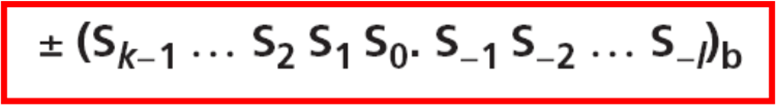
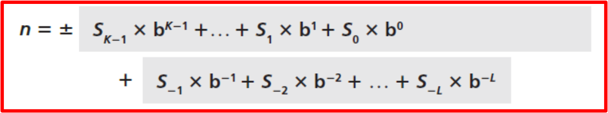

### 📌 Chapter 1

👉 **Objectives**
- Define / định nghĩa Turing model of conputer
- Define / định nghĩa von Neumann model of conputer
- Describe 3 components of computer: `hardware`, `data` and `software`

👉 **TURING MODEL**
- Ý tưởng được giới thiệu lần đầu năm 1937 by Turing
- Mọi phép tính đều có thể đc thực hiện bởi 1 loại máy đặc biệt gọi là `Turing machine`
- Mô hình sẽ mô phỏng các hành động mà con người thực hiện khi tham gia vào quá trình tính toán
- Những hành động đó được chuyển thành một mô hình để máy tính toán ➡️ bước đột phá thay đổi thế giới

👉 **Data processors**
- Acts as a box accept input, processes data and export output
- Each model do a single job
- Nowaday computer were updated ➡️ can do many types of tasks

👉 **Programmable data processors / Bộ xử lý dữ liệu có thể lập trình**
- Program được added to computer as a specific element
- Output depend on 2 factors: `input` and `program`

👉 **The universal Turing machine / Máy Turing vạn năng**
- Loại máy này có thể thực hiện bất cứ phép tính nào miễn là có chương trình thích hợp
- Đây là mô tả đầu tiên của một chiếc máy tính hiện đại

👉 **VON NEUMANN MODEL**
- Computer hiện đại có nguồn gốc USA 1940's
- Đáng chú ý nhất là von Neumann
- Ông đã phát triển một model rất cơ bản mà ta vẫn dùng cho tới ngày nay

👉 **Von Neumann model subsystem**
- Divided to 4 subsystems: `Memory`, `ALU`, `Control Unit` and `I/O system`

👉 **Thực hiện lệnh tuần tự**
- Control unit lấy 1 lệnh từ `memory` rồi `giải mã`, cuối cùng là `thực thi`.
- Lệnh này có thể gọi lệnh trước hoặc sau nó, nhưng không có nghĩa là không tuần tự

👉 **COMPUTER GENERATIONS**
- 1st: Sử dụng `Vaccum Tubes` ( bóng chân không ), kích thước lớn, toả nhiệt cao, tốc độ chậm
- 2nd: Thay `Vaccum Tubes` by `Transister` ➡️ Giảm kích thước, tiết kiệm điện
- 3th: `ICs` (Mạch tích hợp) ra đời, tích hợp hàng nghìn `transistors` trên một chip
- 4th: `Microprocessor` (Vi xử lý) xuất hiện, bắt đầu từ intel 4000 ➡️ 4-bit ➡️ 8/16/32/64-bit ➡️ Multi-core (đa lõi)
- 5th: `VLSI` (Very Large Scale Integration) - hảng tỷ `transistors` trên một chip ➡️ Tăng mạnh hiệu suất
- 6th: `ULSI` (Ultra Large Scale Integration) & RISC Microprocessor ➡️ Tăng mạnh hiệu suất & tiết kiệm năng lượng
➡️ Ngày càng nhỏ gọn, mạnh mẽ

👉 **Central Processing Unit (CPU)**
- Perform operations on data
- ALU thực hiện các phép toán logic, dịch bit và số học trên data
- Logic: NOT, AND, OR, XOR
- Shift: dịch logic, dịch số học ➡️ thay đổi vị trí bit trong nhị phân
- Arithmetic: thực hiện các phép toán số nguyên, số thực

👉 **Registers**
- Chứa dữ liệu tạm thời, làm việc nhanh chóng, cần có nhiều để xử lý tốt hơn

### 📌 Chapter 2 - NUMBERING SYSTEM

👉 **Introduction**
- Hệ thống chữ số xác định cách một số được biểu diễn bằng các kí hiệu riêng biệt
- Một số có thể được biểu diễn khác nhau trong các hệ thống khác nhau

👉 **Hệ thống số theo vị trí**
- Trong hệ thống số theo vị trí, vị trí của một kí hiệu sẽ xác định giá trị mà nó biểu thị
- Một số trong hệ thống này được biểu diễn dưới dạng sau
> 
- Công thức tổng quát để tính giá trị của số

trong đó `S` là tập hợp các kí hiệu của hệ thống số, `b` là cơ số (base, radix)

👉 **Hệ thập phân**
- Cơ số 10
- Tập hợp các kí hiệu: `{0, 1, 2, ..., 9}`
- Là hệ thống số phổ biến nhất

👉 **Hệ nhị phân** 
> 101.11~2~ =  1 `x` 2^2^ + 0 `x` 2^1^ + 1 `x` 2^0^ + 1 `x` 2^-1^ + 1 `x` 2^-2^ = 5,75~10~

👉 **Hệ thập lục phân**
- Dùng để biểu diễn gọn gàng hệ nhị phân, thường có đầu 0x (biểu thị cho hệ 16)
> (2AE)~16~ = 2 `x` 16^2^ + 10 `x` 16^1^ + 14 `x` 16^0^ = 686~10~

👉 **Hệ bát phân**
> (1256)~8~ = 1 `x` 8^3^ + 2 `x` 8^2^ + 5 `x` 8^1^ + 6 `x` 8^0^ = 686~10~

👉 **Convertion**
- Cần nắm được cách chuyển hệ 

`any` ➡️ `10`
Dùng công thức tổng quát phía trên

`10` ➡️ `any`
Chuyển về hệ nào thì chia cho số đó, sau đó lấy phần dư từ dưới lên

`any` ➡️ `any`
- `16` ➡️ `2`: tách thành các nhóm 4 bit (Phải qua trái)
> (24C)~16~ = 2 -> 0010, 4 -> 0100, C -> 1100 = (0010 0100 1100)~2~
- `2` ➡️ `16`: ngược lại với bên trên
- `8` ➡️ `2`: 
`cách 1` tách thành các nhóm 3 bit (Phải qua trái)
`cách 2` chuyển 8 ➡️ 10 ,  10 ➡️ 2
> (24)~8~ = 2 -> 010, 4 -> 100 = (010100)~2~
- `2` ➡️ `8` ngược lại so với bên trên 
- `8` ➡️ `16`: chuyển 8 ➡️ 2 ,  2 ➡️ 16

### 📌 Chapter 3 - DATA STORAGE

👉 **Introduction**
- Data được chia làm 5 loại: `numbers`, `text`, `audio`, `images` and `video`
- Computer uses `multimedia` to define information contains các type trên

👉 **Data inside computer**
- All informations đều được chuyển thành một kiểu thống nhất (hệ nhị phân) khi lưu trong computer và được chuyển lại dạng ban đầu khi được truy xuất

👉 **Storing numbers**
- Có 2 vấn đề cần xử lý khi lưu trữ số bằng hệ nhị phân như `cách lưu trữ dấu của số` và `cách hiển thị số thập phân`
- Có 1 cách xử lý vấn đề về dấu (chương này học) và có 2 cách xử lý số thập phân
`dấu cố định` lưu một số dưới dạng số nguyên (không có phần thập phân)
`dấu phẩy động` lưu một số có phần thập phân
- Số nguyên không dấu (chỉ nằm trong khoảng 0 -> +vc)
ví dụ: lưu giá trị 7 trong bộ nhớ 8 bit là chuyển 7~10~ ➡️ 111~2~ và thêm các số 0 vào bên trái cho đủ 8 bits
. . . cont

👉 **Storing text**
Văn bản (text) trong máy tính là một tập hợp các ký hiệu dùng để biểu đạt ý tưởng trong một ngôn ngữ.
Các loại ký hiệu trong tiếng Anh:
Chữ cái hoa (A, B, C, …, Z).
Chữ cái thường (a, b, c, …, z).
Số (0, 1, 2, …, 9).
Ký tự đặc biệt (., ?, :, ;, !, …).
Khoảng trắng, xuống dòng, tab để căn chỉnh văn bản.
Phần quan trọng - Biểu diễn ký hiệu bằng mẫu bit (bit patterns)
Mỗi ký hiệu được biểu diễn bằng một chuỗi bit.
Ví dụ: Từ “CATS” có thể được lưu dưới dạng mã nhị phân:
C → 1000011
A → 1000001
T → 1010100
S → 1010011
Điểm cần nhớ khi thuyết trình:
Mọi ký tự trong văn bản thực chất là dãy bit.
Ví dụ "CATS" giúp dễ hiểu hơn về cách mã hóa ký tự.
Dữ liệu văn bản cần có mã hóa chuẩn để máy tính hiểu được.
2. Slide "Codes" (Mã hóa ký tự - ASCII & Unicode)
Nội dung chính:
ASCII (American Standard Code for Information Interchange)

Dùng 7 bit để biểu diễn mỗi ký tự.
Hạn chế: Chỉ hỗ trợ 128 ký tự, không đủ cho các ngôn ngữ khác ngoài tiếng Anh.
Extended ASCII

Dùng 8 bit, mở rộng lên 256 ký tự.
Hỗ trợ thêm các ký tự đặc biệt, dấu tiếng Tây Âu.
Unicode

Dùng 16 bit hoặc 32 bit, hỗ trợ tất cả các ngôn ngữ trên thế giới.
Ưu điểm: Đủ không gian lưu trữ các ký tự đặc biệt, ký tự tiếng Việt, Nhật, Trung Quốc,…
ASCII và Extended ASCII đều là một phần của Unicode.
Bảng so sánh số lượng ký tự với độ dài bit

7 bit → 128 ký tự (ASCII).
8 bit → 256 ký tự (Extended ASCII).
16 bit → 65,536 ký tự (Unicode).
32 bit → 4,294,967,296 ký tự (Unicode mở rộng).
Điểm cần nhớ khi thuyết trình:
ASCII có giới hạn 128 ký tự, không đủ dùng cho ngôn ngữ khác.
Unicode là tiêu chuẩn phổ biến ngày nay vì hỗ trợ nhiều ngôn ngữ.
Ví dụ thực tế: Nếu lưu trữ văn bản tiếng Anh, ASCII có thể đủ. Nhưng với tiếng Việt (chữ "đ", "ơ", "ă"), cần dùng Unicode.
Tóm tắt lại những gì cần nói trong bài thuyết trình:
Văn bản được lưu dưới dạng các ký hiệu, mỗi ký hiệu có một mã nhị phân.
Các bảng mã giúp máy tính hiểu văn bản: ASCII (7-bit), Extended ASCII (8-bit), Unicode (16-bit, 32-bit).
Unicode là tiêu chuẩn hiện đại giúp hỗ trợ tất cả các ngôn ngữ.
Ví dụ cụ thể: Cách mã hóa chữ "CATS", sự khác biệt giữa ASCII và Unicode.