### 📌 Chapter 0 - Introduction about the course

👉 **Why we program?**

- We are also have `mistakes`, quickly `forget` and easy to feel `boring`
- Computer are our assistances, they can help us to finish these task 
- They need to be taught how to work
➡️ To teach they how to working, we use `Programming language`

👉 **Why C is chosen?**

- Cleare structure, ez to understand
- Foundation ( nền tảng ) for many other languages: `C++`, `Java`, `Python`
➡️ Easier for learners to transition to other languages

👉 **Course description - course plan**

1. Introduction to PFC
2. Basic Computation
3. Basic Logics
4. Modules and Functions
5. Pointers
6. Libraries
7. Contiguous Storage
8. Strings
9. Text Files

👉 **Setup tools**

- [Dev C++](https://sourceforge.net/projects/orwelldevcpp/)

___

### 📌 Chapter 1 - Introduction to PFC

👉 **Definitions**
- Information: Knowledge about something
- Data: Collection of information
- Problem: Problem need to be resolved. example: Muốn có một chương trình tự động tính toán thu chi của tháng
- Solve problem: Giải quyết vấn đề. 
- Solution: `kết quả` sau khi chương trình thực hiện và trả về, là thứ mà ta mong muốn sau khi giải quyết một vấn đề.
- Algorithm: Các bước cần thực hiện để giải quyết một vấn đề
- Program: Một chương trình, là tập hợp các algorithm
- Computer program: Là Program được thực hiện trên máy tính

👉 **How to make a good software?**
- Usability: Tính `khả dụng`: user can use program to resolve problem
- Correctness: Tính `chính xác`: Phải đưa ra kết quả chính xác
- Maintainability: Tính `duy trì` or `bảo trì`: Dễ sửa đổi, dễ hiểu
- Portability: Tính `di động`: Có thể chạy trên nhiều nền tảng 

### 📌 Chapter 2 - Basic Computation

👉 **Introduction**
- Data can be: `constants` and `variables`
- 2 basic operations on data are `READ` and `WRITE`

👉 **Variables and data type**
- Có thể hình dung variable là map dẫn đến địa chỉ của một ô nhớ trong bộ nhớ
- When the program compile, the compiler will tự tìm đến nơi data được lưu trữ
- Data có nhiều loại nhưng khi được lưu trữ vào trong máy thì được chia theo loại, gọi là `Data type`
- A data type defines: `how values are stored` and `how the operations perform on those`
- In C, there are 4 primitive data types ( kiểu dữ liệu nguyên thuỷ )
- Xuyên suốt các ví dụ thường gặp `%d`, `%lf`, `%c` hoặc `%f`. Đây là định dạng i/o của Data
- Tuỳ các loại CPU thì sẽ có kiểu lưu trữ dữ liệu khác nhau:
    - `little-endian ordering`: lưu trữ data theo giá trị từ nhỏ tới lớn trong bộ nhớ
    - `big-endian ordering`: ngược loại
- Cú pháp khai báo biến trong C: `data_type var_name [= initial value];`
- Quy tắc đặt tên biến trong C: 
- Các hành động có thể thực hiện trên variables: 
    - assign a constant value to a variable
    - assign the value of another variable to a variable, ...
- Cho làm bài tập nhận biết các cú pháp khai báo biến sai

👉 **Literals**
- Chỉ cần nhớ `\n` dùng để enter / newline
- Có thể dùng `\` để bỏ qua những cú pháp khó chịu:
    - ví dụ: `printf("He said \"Hello world\"")`
- Có thẻ lâu lâu sẽ gặp các giá trị có kiểu: 1.23F, 234567658LL, 213124L, ... thì đây dùng làm đại diện cho số `float`, `long long` hoặc `Long`

👉 **Khai báo constant**
- `#define PI 3.14`
- `const PI1 = 3.141592`
- `const double PI2 = 3.141593`

👉 **Định dạng I/O**
- Khi nhập sai định dạng với scanf(), lỗi có thể dự đoán trước nhưng hành vi không phải lúc nào cũng rõ ràng. Các lỗi phổ biến gồm:
    - Lỗi bộ nhớ: Nhập `%lf` vào int → Ghi đè dữ liệu ngoài vùng nhớ, có thể crash chương trình.
    - Nhập `%s` vào int → Lỗi truy cập bộ nhớ (Segmentation Fault).
    - Lỗi dữ liệu sai (Data Mismatch):
    - Nhập số thực với `%d` → Chỉ lấy phần nguyên, phần thập phân bị bỏ.
    - Nhập ký tự với `%d` → Ký tự được chuyển thành giá trị ASCII.
    - Lỗi bỏ qua nhập liệu (Buffer Issue): `%c` sau `%d` bị bỏ qua do ký tự `\n` còn trong buffer.
- Phân biệt 2 lệnh sau: 
    - `printf("%d", &x);` : in ra địa chỉ của biến `x`
    - `printf("%d", x);` : in ra giá trị của biến `x`
- Nhấn mạnh là giá trị bên phải phép gán sẽ gán cho bên trái: `x = y`
- Cho làm bài tập hiện ra màn hình câu lệnh lấy input, sau đó lấy input từ bàn phím, sau đó in ra địa chỉ & giá trị của biến mới lấy

👉 **Các phép tính**
- Các phép tính toán: `+`, `-`, `*`, `/`, `%`, `++x`, and `x++`
    - Nhớ  là phép `%` chỉ áp dụng cho số nguyên
- Các phép tính quan hệ: `<`, `<=`, `==`, `!=` 
- Các phép tính logic: `&&`, `||`, `!(not)`
- Các phép tính trên bit: `&`, `|`, `^`, `>>`, `~`
- Giải thích `x += 1`

👉 **Mixing Data Type**
- ALU không trực tiếp thực hiện phép toán trên các toán hạng có kiểu dữ liệu khác nhau, chỉ làm việc với các toán hạng có cùng kiểu dữ liệu.
- C compiler tự động chuyển đổi kiểu dữ liệu nếu một biểu thức chứa toán hạng có kiểu khác nhau.
- Khi có hai kiểu dữ liệu khác nhau, trình biên dịch sẽ chuyển kiểu (type conversion) theo thứ tự ưu tiên sau:
    - `double` > `float` > `long` > `int` > `char`
    - Tức là, nếu một phép toán có toán hạng int và double, int sẽ được chuyển thành double trước khi tính toán.
    - ví dụ:    

### 📌 Chapter 3 - Basic Logics

👉 **Logic Constructs**
- Logic constructs là những cấu trúc giúp viết chương trình hoạt động một cách hiệu quả.Gồm các khái niệm như
    - `Structured Programming`: Lập trình có cấu trúc giúp mã nguồn rõ ràng.
    - `Sequence Constructs`: Các câu lệnh được thực hiện theo thứ tự.
    - `Selection Constructs`: Những câu lệnh điều kiện như 'if' hay 'switch'.
    - `Iteration Constructs`: Vòng lặp cho phép thực hiện đoạn mã nhiều lần như 'for' và 'while'.
- **Structured Programming**
    - Lập trình có cấu trúc là một phương pháp tổ chức mã nguồn sao cho dễ hiểu, dễ kiểm tra và dễ sửa. Nó được xây dựng dựa trên các cấu trúc logic đơn giản.
    - Một chương trình tốt sẽ có cấu trúc rõ ràng với từng điểm vào và điểm ra. Thiết kế trước khi lập trình rất quan trọng.
    - `Pseudo-code` (Giả mã): 
        - diễn đạt thuật toán bằng ngôn ngữ gần gũi với con người
        - Dùng từ khóa gần giống với ngôn ngữ lập trình (IF, ELSE, WHILE, FOR) nhưng không tuân theo cú pháp cụ thể của bất kỳ ngôn ngữ lập trình nào.
        - Giúp xác định luồng chương trình trước khi viết mã.
        - Ví dụ: 

    - `Flow Charting`(Lưu đồ thuật toán): 
        - Biểu diễn hướng giải quyết bằng sơ đồ.
        - 

- **Sequence Constructs**
    - Cấu trúc tuần tự là một câu lệnh đơn giản hoặc một khối mã.
    - Câu lệnh đơn giản: expression ;
    - Khối mã: Một khối mã là tập hợp các câu lệnh được đóng trong dấu ngoặc nhọn.

- **Cấu trúc Lựa chọn (Selection Constructs)**
    - Giải thích 3 loại là `IF-ELSE`, `SWITCH-CASE` và `toán tử 3 ngôi`
    - Cú pháp của các cấu trúc trên

- **Iteration (loop) Constructs**
    - Làm 1 công việc nhiều lần nhưng chỉ cần viết 1 đoạn code
    - Các thành phần chính: `Initialization`, `Condition`, `Loop Body` và `Update`
    - Trong C có 3 loại vòng lặp thường dùng:
        - FOR loop: dùng khi biết trước sẽ lặp bao nhiêu lần
        
        - WHILE loop: dùng khi không biết số lần lặp, chỉ biết điều kiện dừng
        
        - DO - WHILE: luôn thực thi 1 lần rồi mới check điều kiện
        
    - Từ khóa điều khiển vòng lặp: `break`, `continue` và `goto` (đúng ai dèo)
        - `break`: Dùng để dừng vòng lặp ngay lập tức.
        
        - `continue`: Bỏ qua lần lặp hiện tại và tiếp tục với lần lặp tiếp theo.
        
        
        - `goto`: nhảy trực tiếp đến một nhãn trong mã, nhưng thường gây khó hiểu và không khuyến khích sử dụng.
        
    - Flag: có tác dụng ngắt vòng lặp mà tránh `break` và `goto` ➡️  code dễ đọc và bảo trì hơn ➡️ RECOMMENT

👉 **Programming Styles**
- Tại sao phong cách lập trình quan trọng?
    - Dễ đọc & dễ hiểu:Code rõ ràng giúp dev khác (hoặc chính mình trong tương lai) dễ hiểu, chỉnh sửa.
    - Dễ bảo trì: Code được viết theo phong cách tốt giúp giảm thời gian sửa lỗi và mở rộng tính năng.
    - Đồng bộ trong nhóm: Giúp nhiều lập trình viên làm việc chung một dự án mà không bị rối.

- Các yếu tố cần quan tâm
    - Quy ước đặt tên (Naming Conventions)
        - Tên biến: Đặt tên rõ ràng, mô tả chức năng (`int studentCount;` thay vì `int sc;`).
        - Tên hàm: Bắt đầu bằng động từ mô tả hành động (`calculateSum()` thay vì `sum()`).
        - Tên hằng số: Dùng chữ in hoa và dấu gạch dưới (`#define MAX_SIZE 100`).
    - Thụt lề và khoảng trắng
        - Sử dụng 4 khoảng trắng hoặc tab để thụt lề (tùy theo chuẩn nhóm).
        - Giữ khoảng trắng xung quanh toán tử (`a = b + c;` thay vì `a=b+c;`).

👉 **Walkthroughs (Theo Dõi Luồng Thực Thi)**
- Giúp dev hiểu rõ cách chương trình hoạt động từ các bước nhỏ.
- Thay vì phụ thuộc vào máy thì ta tự chạy chương trình trong đầu mình

### 📌 Chapter 4 - Modules and Functions

👉 **Objectives**
- Sau bài này cần nắm được:
    - `Module` và `Function` trong C là gì
    - Cách chia chương trình thành các module nhỏ hơn
    - Cách triển khai & sử dụng function trong C
    - Phạm vi & tuổi thọ của variable

👉 **What is module?**
- `Module` là một phần của chương trình thực hiện một chức năng cụ thể
- Có thể sử dụng độc lập hoặc kết hợp với các module khác
- Ví dụ thực tế: Nấu cơm = rửa nồi + đong gạo + vo gạo + cho nước + bật bếp 
- Một chương trình cũng vậy, chia một việc lớn thành các công việc ( module ) nhỏ
➡️ Module giúp giảm độ phức tạp, tăng khả năng tái sử dụng

👉 **Đặc điểm của module**
- Cohesion (tính gắn kết cao): Mỗi module chỉ làm một công việc cụ thể
- Low Coupling (Sự phục thuộc thấp): Các module độc lập, ít phụ thuộc nhau
- Có một i/o: Dễ kiểm soát luồng xử lý
- Có thể đặt trong một file riêng: Ví dụ như `stdio.h` là một module chứa các hàm nhập/xuất

👉 **Chia nhiệm vụ thành các module**
- A program can devide to many small modules
- Mỗi module có một chức năng duy nhất
- ➡️ Dễ hiểu, dễ bảo trì & tái sử dụng

👉 **Function in C**
- Hàm là một module trong C, có thể nhận tham số và trả về giá trị
- Nếu một hàm không cần trả về giá trị, dùng void

👉 **Main() function**
- Hàm `main()` là bắt buộc trong C
- Khi chương trình chạy, `main()` được gọi đầu tiên
- main() có thể trả về giá trị `int`

👉 **Truyền tham số vào function**
- Phân biệt `tham số (parameter)` và `đối số (argument)`
    - `parameter` biến được khai báo trong func
    - `argument` giá trị truyền vào khi gọi func

👉 **Hàm nguyên mẫu ( Function Prototype )**
- Function có thể được khai báo trước, sau đó mới định nghĩa (để tránh lỗi biên dịch)

👉 **Phạm vi & tuổi thọ của biến**
- `Biến toàn cục` Khai báo ngoài mọi hàm, có thể dùng mọi nơi
- `Biến cục bộ` Khai báo trong một hàm và chỉ sử dụng được trong hàm đó

### 📌 Chapter 5.1 - Pointer

👉 **Giới thiệu về Con Trỏ**
- Con trỏ là một biến lưu trữ địa chỉ của một biến khác.
- Sử dụng con trỏ giúp tối ưu hóa chương trình, giảm bộ nhớ sử dụng và tăng hiệu suất.

ví dụ khai báo con trá»: 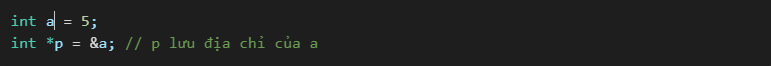

👉 **Cấu trúc bộ nhớ trong C**
- `Code Segment` Chứa mã chương trình.
- `Data Segment` Chứa biến toàn cục và hằng số. Tất cả các func đều có thể truy cập bộ nhớ này
- `Stack Segment` Chứa biến cục bộ, thông tin hàm. Các biến được khai báo trong hàm chỉ tồn tại khi hàm được thực thi và sẽ bị xóa khi thực thi xong
- `Heap Segment` Chứa bộ nhớ cấp phát động.

👉 **Toán tử trên con trỏ**
- `&` lấy địa chỉ của biến
- `*` Truy cập giá trị của biến mà con trỏ trỏ tới

👉 **Pass-by-value và Pass-by-preference**
- `Pass-by-value` được hiểu là khi bạn thay đổi biến trong hàm thì ngoài hàm sẽ không bị ảnh hưởng. Nó giống như bạn copy giá trị của biến vào biến khác rồi truyền vào hàm.
- `Pass-by-reference` là khi bạn thay đổi biến trong hàm cũng làm ngoài hàm bị ảnh hưởng. Nó giống như bạn truyền đúng địa chỉ của biến đó vào hàm.
- ➡️ `C` là ngôn ngữ `pass-by-value`

### 📌 Chapter 5.2 - Programming With Menu

- Menu giúp người dùng chọn chức năng dễ dàng hơn.
- Dùng switch-case để quản lý các lựa chọn.
ví dụ 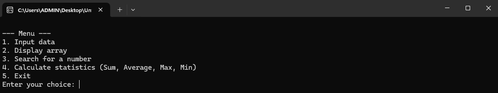

### 📌 Chapter 5.3 - Libraries in C

- Thư viện giúp tái sử dụng mã nguồn và cung cấp các hàm tiện ích.
- Các thư viện tiêu chuẩn trong C:
    - `stdlib.h` Quản lý bộ nhớ, random số.
    - `math.h` Các phép toán toán học.
    - `ctype.h`Xử lý ký tự
    - `time.h`
Ví dụ 
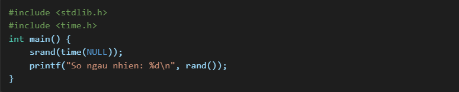
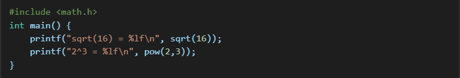
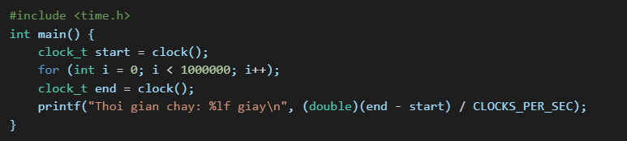
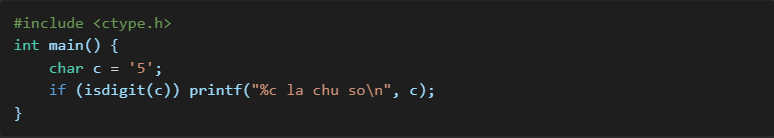
    
- ➡️ Sử dụng library  giúp tối ưu hóa lập trình. Biết cách sử dụng các thư viện giúp code ngắn gọn hơn.

### 📌 Chapter 6 - Contiguous Storage

👉 **Mảng tĩnh ( Static Arrays )**
ví dụ
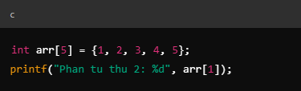
- Mảng `arr` có kích thước cố định (5 phần tử).
- `arr[1]` có địa chỉ `arr + 1`, do mỗi phần tử kiểu int thường chiếm 4 byte.
- 🎯 Ứng dụng:
    - Khi cần dữ liệu có kích thước cố định, không thay đổi trong quá trình chạy.
    - Dùng khi xử lý dữ liệu I/O cố định.

👉 **Giới thiệu về Contiguous Storage**    
- `arr` là một mảng có 5 phần tử, được lưu trữ liên tục trong bộ nhớ.
- Địa chỉ của arr[0] là điểm bắt đầu, arr[1] nằm ngay sau đó, cứ thế tiếp tục.
- 🎯 Ý nghĩa & Ứng dụng:
    - Dữ liệu được lưu trữ liên tục giúp truy cập nhanh hơn do CPU chỉ cần tính toán địa chỉ của phần tử dựa trên vị trí đầu tiên.
    - Contiguous Storage là cơ sở cho mảng, chuỗi, cấp phát động, giúp tối ưu hiệu suất khi thao tác với dữ liệu lớn.

👉 **Bộ nhớ cấp phát động (Dynamic Memory Allocation)**    
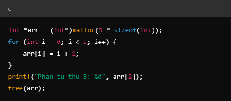
- `malloc(5 * sizeof(int))` cấp phát vùng nhớ động chứa 5 số nguyên liên tiếp.
- `free(arr);` giải phóng bộ nhớ sau khi dùng để tránh rò rỉ bộ nhớ.
- 🎯 Ứng dụng:
    - Khi cần cấu trúc dữ liệu linh hoạt, không biết trước kích thước dữ liệu.
    - Dùng trong các chương trình xử lý dữ liệu lớn, danh sách động, hệ thống quản lý bộ nhớ.

👉 **Chuỗi ký tự (Character Arrays)**  
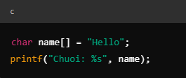
- Chuỗi `"Hello"` được lưu trong mảng các ký tự liên tiếp, kèm ký tự kết thúc `\0`.
- Truy xuất nhanh nhờ cách lưu liên tục trong bộ nhớ.
- 🎯 Ứng dụng:
    - Dùng để xử lý chuỗi, đọc ghi file, giao tiếp dữ liệu dạng text.
    - Cấu trúc cơ bản cho xâu ký tự (string) trong nhiều ngôn ngữ lập trình.

👉 **Con trỏ và Contiguous Storage**  
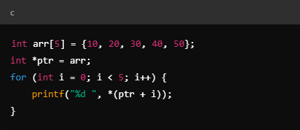
- `ptr = arr;` → `ptr` trỏ đến phần tử đầu tiên của arr.
- `*(ptr + i)` → Dùng toán tử con trỏ để truy xuất từng phần tử trong mảng.
- 🎯 Ứng dụng:
    - Duyệt mảng nhanh hơn so với dùng chỉ số `(arr[i])`.
    - Dùng trong hàm xử lý dữ liệu, giúp tối ưu bộ nhớ bằng cách truyền con trỏ thay vì sao chép mảng.

👉 **So sánh Contiguous Storage với Non-Contiguous Storage** 
- Mảng (Contiguous Storage): Phần tử nằm liên tiếp → Truy xuất nhanh, nhưng khó thay đổi kích thước.
- Danh sách liên kết (Non-Contiguous Storage): Phần tử nằm rải rác, kết nối bằng con trỏ → Linh hoạt, nhưng truy xuất chậm hơn.
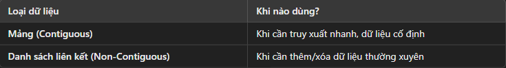

### 📌 Chapter 7 - Strings

👉 **Giới thiệu String** 
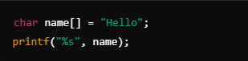
- Chuỗi trong C là mảng ký tự kết thúc bằng ký tự NULL (`\0`).
- `"Hello"` có 6 ký tự trong bộ nhớ (`H`, `e`, `l`, `l`, `o`, `\0`).
- 🎯 Ứng dụng:
    - Lưu trữ và xử lý dữ liệu văn bản.
    - Dùng trong hệ thống file, giao tiếp mạng, và xử lý đầu vào người dùng.

👉 **Khai báo và khởi tạo chuỗi** 
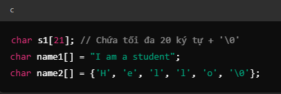

👉 **Nhập và xuất chuỗi** 
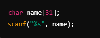
- `scanf("%s", name)` chỉ đọc đến khoảng trắng đầu tiên.
- Cách khắc phục:
    

👉 **Các hàm thao tác với chuỗi (string.h)** 
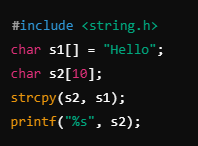
- `strcpy(s2, s1);` sao chép nội dung từ `s1` sang `s2`.
- Dùng `strlen()`, `strcat()`, `strcmp()` trong xử lý văn bản, dữ liệu đầu vào.

👉 **Mảng chuỗi (Array of Strings)** 
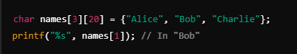
- `names` là mảng chứa nhiều chuỗi.
- 🎯 Ứng dụng:
    - Quản lý danh sách sinh viên, từ điển, menu giao diện.

➡️ Chuỗi trong C là mảng ký tự, cần kết thúc bằng `\0`

### 📌 Chapter 8 - Text and Files

👉 **Định nghĩa File** 
- File là tập hợp dữ liệu có tên, giúp lưu trữ thông tin lâu dài.
- Có thể lưu trên đĩa cứng, USB, hoặc bộ nhớ đám mây.
- 🎯 Ứng dụng:
    - Quản lý dữ liệu người dùng (tài khoản, điểm thi).
    - Lưu trữ log hệ thống, xuất báo cáo.

👉 **Loại File: Văn bản vs Nhị phân** 
ví dụ file văn bản ( `.txt` )
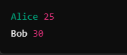

ví dụ file nhị phân ( `.bin` ) 
- File văn bản: Dễ đọc nhưng chiếm nhiều dung lượng.
- File nhị phân: Hiệu suất cao nhưng khó kiểm tra nội dung.
- 🎯 Ứng dụng:
    - Văn bản: Báo cáo, nhật ký hệ thống.
    - Nhị phân: Lưu trữ dữ liệu nhanh (cấu hình game, cơ sở dữ liệu).

👉 **Các bước làm việc với file** 
Ví dụ **đọc** file
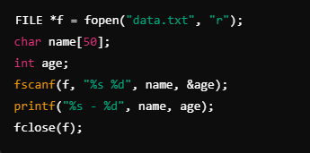
- `fopen("data.txt", "r")` mở file để đọc.
- `fscanf()` đọc dữ liệu theo định dạng.
- `fclose(f)` đóng file sau khi dùng.
➡️ Đọc dữ liệu

Ví dụ **viết** file  ( `fopen`, `fprintf` )
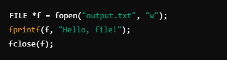
- Chế độ `"w"` Xóa nội dung cũ, ghi mới.
- Dùng `"a"` Ghi thêm vào cuối file.
➡️ Xuất dữ liệu từ phần mềm ra file báo cáo.

👉 **Hàm làm việc với file ( `fgetc, fputc` )**
Ví dụ đọc từng ký tự
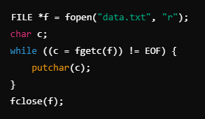
- `fgetc()` đọc từng ký tự cho đến khi gặp `EOF`.
➡️ Đọc từng ký tự trong file cấu hình, mã nguồn.

👉 **Di chuyển con trỏ file ( `fseek`, `rewind` )**
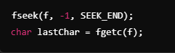
- `fseek(f, -1, SEEK_END)` dịch con trỏ về cuối file.
➡️ Truy xuất dữ liệu nhanh mà không cần đọc cả file.

👉 **Tổng kết FILE trong C**
- File giúp lưu trữ dữ liệu lâu dài thay vì bộ nhớ RAM.
- Dùng đúng chế độ mở file (`r`, `w`, `a`).
- Quản lý file đúng cách (`fclose()`, tránh lỗi file bị khóa).